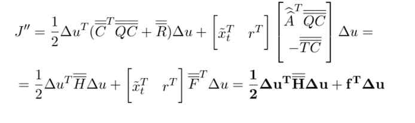
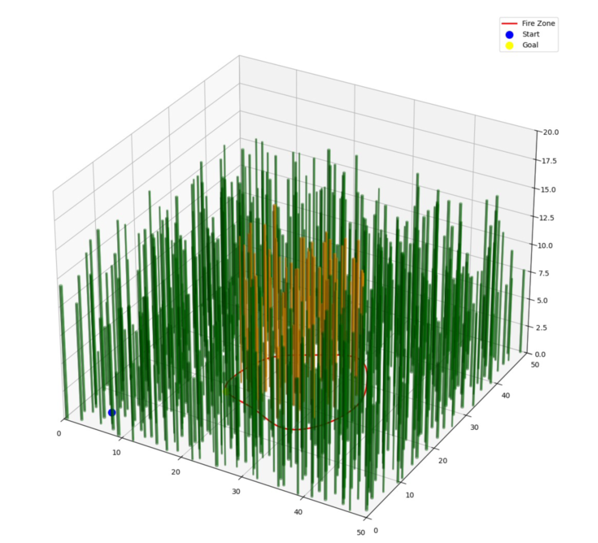
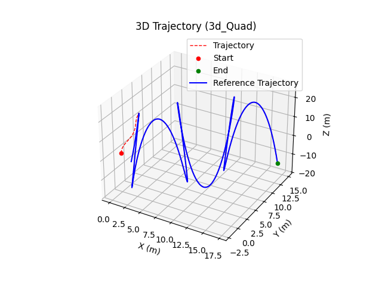

# Fire-Quadrotor
## .gif visualization:

  

## **Project Description**

We are developing a 3D simulation of a quadcopter drone navigating through a **dense forest** to extinguish a fire. The simulation combines **path planning** with **RRT\***, **dynamic trajectory optimization**, and **advanced control strategies** (e.g., **LPV-MPC**). The goal is to explore efficient algorithms for navigating cluttered environments while maintaining dynamic constraints, all while allowing real-time adjustments. Ultimately, the project is planned for integration within advanced visualization frameworks such as Gazebo.

For additional details, including more images and videos of our results, please consult the accompanying **paper**.

## Math and Force Body Diagram:

  

<em>Force Body Diagram</em>

  

<em>Dynamics Equations.</em>

  

<em>MPC Final Cost - see paper for more info.</em>

---

### **Core Objectives**

1. **Forest Navigation**:
   - **Randomized 3D Forest Generation**: Systematically place cylindrical obstacles (trees) by randomly determining location, radius, and height.
   - **Efficient Path Planning**: Implement and compare **RRT\***-based algorithms to navigate from the drone’s start point to a designated fire zone, ensuring safe obstacle avoidance.

2. **Fire Extinguishing Scenario**:
   - Define a fire zone in the forest as a bounded region (e.g., spline-based).
   - Simulate the quadcopter’s arrival at the fire zone and basic extinguishing actions (hovering, spraying, etc.).

3. **Quadcopter Dynamics and Trajectory Optimization**:
   - Model the full nonlinear dynamics of the quadcopter.  
   - Employ **Linear Parameter-Varying Model Predictive Control (LPV-MPC)** to compute and track feasible trajectories while respecting system constraints on velocity, angular rates, and proximity to obstacles.

4. **Simulation and Visualization**:
   - Visualize the quadcopter’s 3D flight through the generated forest and over the fire zone.
   - Incorporate **dynamic re-planning**: handle control updates at each timestep for precise trajectory tracking.

---

### **Figures & Media**

- **Fig. 1** – *Randomly Generated 3D Forest map*  
  

- **Fig. 2** – *Fast and optimal RRT\* pathfinding in obstacle dense forest*  
  

- **Fig. 4** – *Quadrotor dynamics force diagram*  
  

- **Fig. 5** – *Final Costs used in the LPV-MPC*  
  )

- **Fig. 7** – *LPV-MPC with 30 Integral steps (Low Precision)*  
  

- **Fig. 8** – *LPV-MPC with 80 Integral steps (High Precision)*  
  

**Demo Video**  
A short video of the drone navigating the randomized 3D forest can be viewed here:  
[Demo Video Link](img/quadrotor_trajectory_TPV_forest3.mp4)

For further details and additional videos/figures, please consult the accompanying **paper**.
